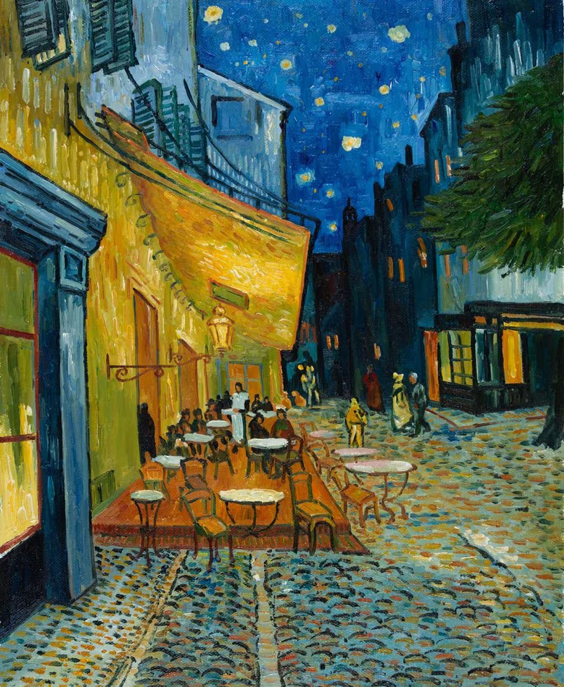

# Lab 6 - Recognition and Classification
*_Peter Cheung, version 1.0, 29 Feb 2024_*

This laboratory session is designed to support the contents of Lectures 10 and 11 of the module.  

## Task 1: Image resizing

The following image is the famous painting by van Gogh called 'Cafe Terrace at Night', which can be found in the file **_'cafe_van_gogh.jpg'_** in the assets folder.  

<p align="center">  </p>

Write a Matlab program to read this file and build the image pyramid by resize the image by a factor of 1/2, 1/4, 1/8, 1/16 and 1/32 by drop every other rows and columns.  Then display all six images as a montage of size [2 3]. 

To drop every other rows and columns in an image, you can use a power Matlab syntax: (start: increment: end) for the next.  Try this Matlab command:

```
1:2:10
1:3:10
```
The first command returns the values: 1, 3, 5, 7 and 9.
The second command returns the values: 1, 4, 7, 10.

Matlab provides a proper image resizign function **_imresize(I, scale)_** where I is the input image and scale is the factor to resize.  So 0.5 means the image is reduced by a factor of 2. This function first filter the image by a lowpass filter (Gaussian) that remove the high frequency components before subsampling by skipping pixels.  This prevent aliasing and the introdduction of artifacts.

Repeat the above exercise by adding code to properly resize the image with the **_imresize_** function.

## Task 2: Pattern Matching with Normalized Cross Correlation

In this task, we will examine how to use Matlab's normalized cross correlation (NCC) function **_normxcorr2( )_** to match a template in file **_'assets/template1.tif'_** to that of the image **_'salvador_grayscale.tif'_**.

The following code will compute the NCC function and plot it as a 3D plot:

```
clear all; close all;
f = imread('assets/salvador_grayscale.tif');
w = imread('assets/template2.tif');
c = normxcorr2(w, f);
figure(1)
surf(c)
shading interp
```

Try this code and explore the correlation between the template and the image.  You should be able manually locate the position of the template in the image. This will be the location that the normalized cross correlation value = 1.0, i.e. an exact match.

Now we want to detect the peak location automatically. This is achieve with:

```
[ypeak, xpeak] = find(c==max(c(:)));
yoffSet = ypeak-size(w,1);
xoffSet = xpeak-size(w,2);
figure(2)
imshow(f)
drawrectangle(gca,'Position', ...
    [xoffSet,yoffSet,size(w,2),size(w,1)], 'FaceAlpha',0);
```

Find out for yourself what the Matlab function **_find_** does.  Comment on the results.

Test this procedure again with the second template image **_'template2.tif'_**.

It is clear that NCC can only match a template to an image if the match is exact or nearly exact.

## Task 3: SIFT Feature Detection

Let us now try to apply the SIFT detector provided by Matlab through the function **_detectSIFTFeastures( )_** on the Dali painting that we used in task 2.

```
clear all; close all;
I = imread('assets/salvador.jpg');
f = im2gray(I);
points = detectSIFTFeatures(f);
figure(1); imshow(I);
hold on;
plot(points.selectStrongest(100));
```
>Comment on the results.
>Explore and explain the contents of the data structure *_points_*. You may want to consult this [Matlab page](https://uk.mathworks.com/help/vision/ref/siftpoints.html) about SIFT Interesting Points.

>Find the SIFT points for the image **_'cafe_van_gogh.jpg'_**.

> Explore these other methods of feature detection provided by Matlab in their toolboxes.

## Task 4: SIFT matching

We will now use SIFT features from two different scales of the same van Gogh painting to see how well SIFT manage to match the features that are of different scales (or sizes).

Enter the following:

```
clear all; close all;
I1 = imread('assets/cafe_van_gogh.jpg');
I2 = imresize(I1, 0.5);
f1 = im2gray(I1);
f2 = im2gray(I2);
points1 = detectSIFTFeatures(f1);
points2 = detectSIFTFeatures(f2);
Nbest = 100;
bestFeatures1 = points1.selectStrongest(Nbest);
bestFeatures2 = points2.selectStrongest(Nbest);
figure(1); imshow(I1);
hold on;
plot(bestFeatures1);
hold off;
figure(2); imshow(I2);
hold on;
plot(bestFeatures2);
hold off;
```
The code above find the Nbest features found by SIFT and overlay them onto the two images.

>How successful do you think SIFT has managed to detect features for these two images (one is a quarter of the size of the other)?

## Task 4: SIFT matching - scale and rotation invariant

The arrays *_points1_* and *_points2_* contains the interesting points in the two images.  We now want to match the best *_Nbest_* points between the two sets. This is achieved as below:

```
[features1, valid_points1] = extractFeatures(f1, points1);
[features2, valid_points2] = extractFeatures(f2, points2);

 indexPairs = matchFeatures(features1, features2, 'Unique', true);

 matchedPoints1 = valid_points1(indexPairs(:,1),:);
 matchedPoints2 = valid_points2(indexPairs(:,2),:);
 figure(3);
 showMatchedFeatures(f1,f2,matchedPoints1,matchedPoints2);
```
Comment on the results.
Now replace:
```
[features1, valid_points1] = extractFeatures(f1, points1);
```
with:
```
[features1, valid_points1] = extractFeatures(f1, bestFeatures1);
```
Comment on the results.

Next, rotate the smaller image by 20 degrees using the Matlab function **_imrotate( )_** and show that indeed SIFT is rotation invariant.

## Task 5: SIFT vs SURF

In addition to SIFT, there are other recently developed methods to detect features. These include:
* SURF
* KAZE
* BRISK
and others.  You will find these methods listed [here](https://uk.mathworks.com/help/vision/ug/local-feature-detection-and-extraction.html).

Let us now try to match two images from a video sequence of motorway traffic wtih cars moving bewteen frames.  The two still images are stored as *_'traffic_1.jpg'_* and *_'traffic_2.jpg'_*.  

Use the same program in Task 4 to find the matching points between these two frames using SIFT.   Comment on the results.

Now change the algorithm from SIFT to SURF, and see what the difference in the matching results.

What you have just done is to apply SIFT and SURF feature detection to perform object tracking between successive frames in a video.


## Task 6: Image recognition using neural networks

This task requires you to install a number of packages on Matlab beyond what you already have on your systems.  You will be using a USB webcam (five a available for you to borrow and share), and for this to work, you will need to install the camera support package for your machine (either Mac or PC).  You will also need to install the specific neural network model (e.g. AlexNet) on your machines.

Enter the following:
```
% Lab 6 Task 6 
% Object recognition using webcam and various neural network models

camera = webcam;
net = google;               % change this for other networks
inputSize = net.Layers(1).InputSize(1:2);
figure 
I = snapshot(camera);
image(I);
f = imresize(I, inputSize);
tic;                        % mark start time
[label, score] = classify(net,f);
toc                         % report elapsed time
title({char(label), num2str(max(score),2)});
```

> Use the webcam to try to recognize different objects.  Also try to find the accuracy and speed of recogniture for different networks.
>
> Modify this code so that you capture and recognize object in a continous loop.

You may also want to read and explore these online documents that accompany Matlab:

[Deep learning in Matlab](https://uk.mathworks.com/help/deeplearning/ug/deep-learning-in-matlab.html)
[Pretrained CNN](https://uk.mathworks.com/help/deeplearning/ug/pretrained-convolutional-neural-networks.html)
